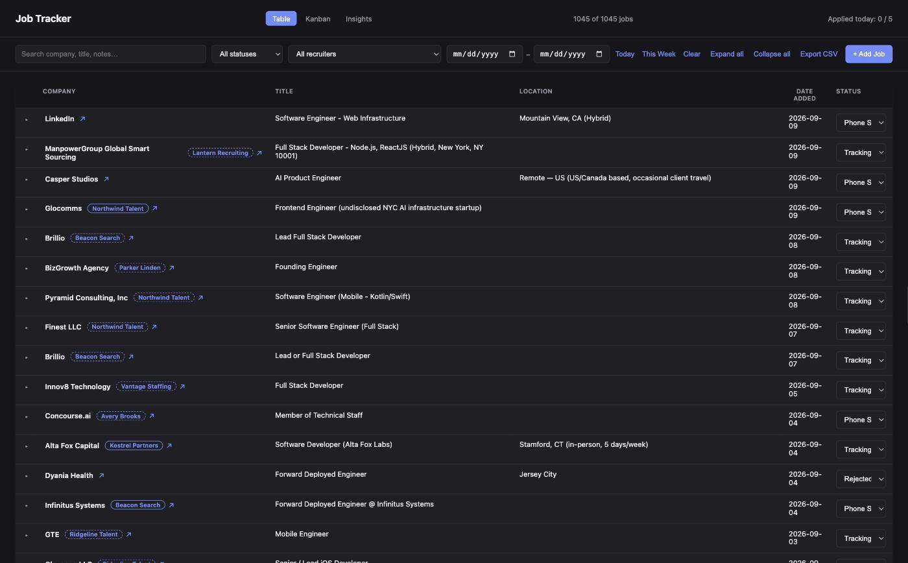
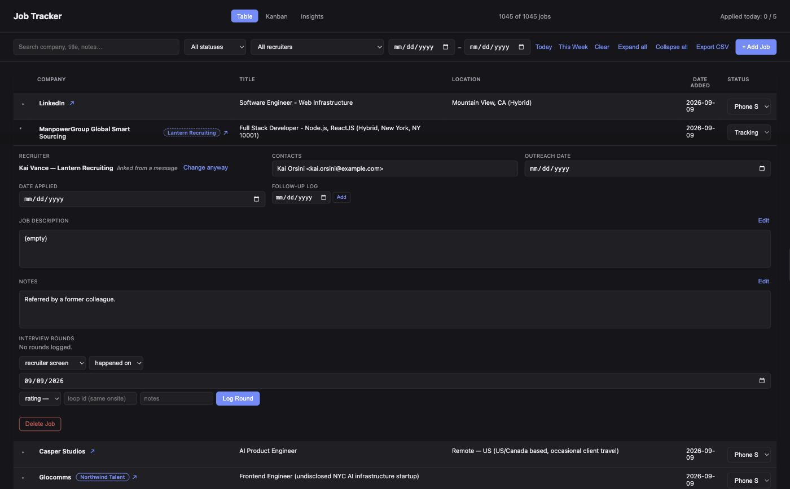
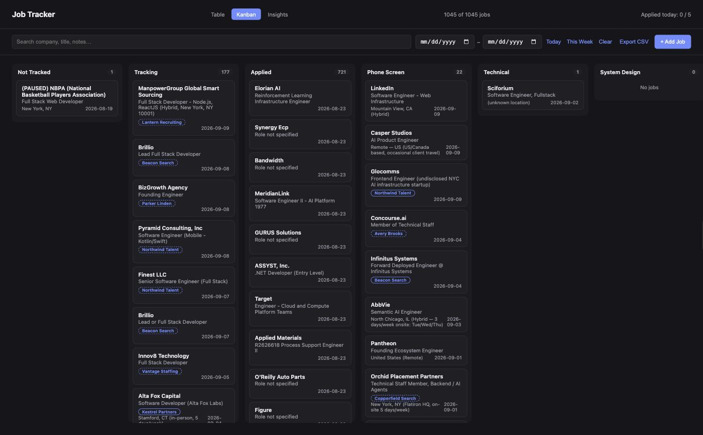
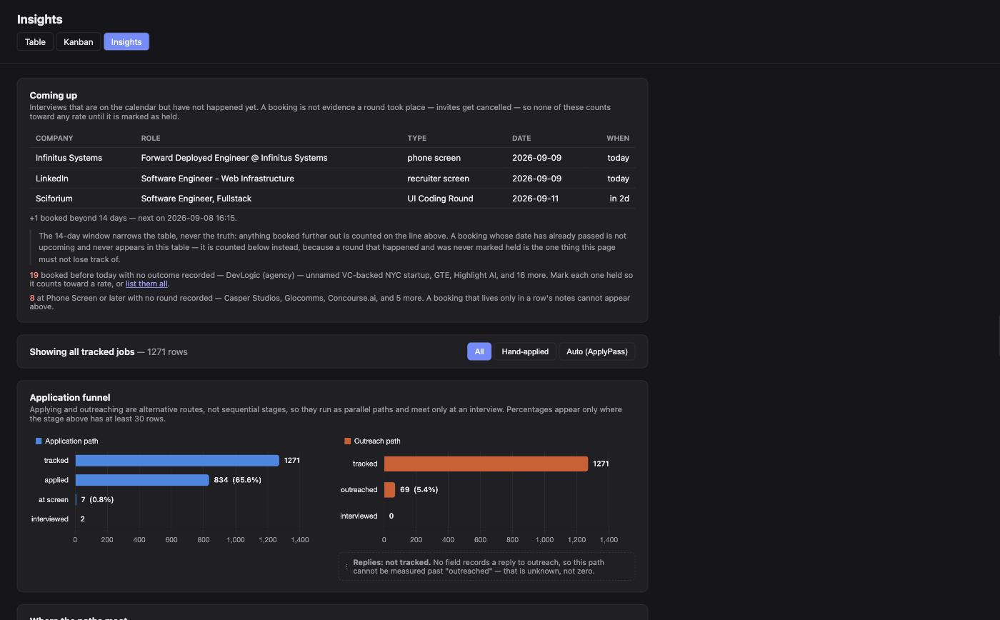
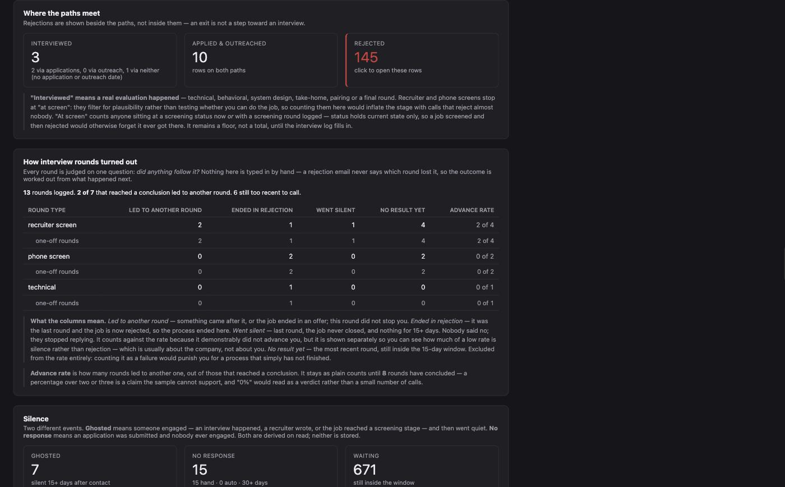
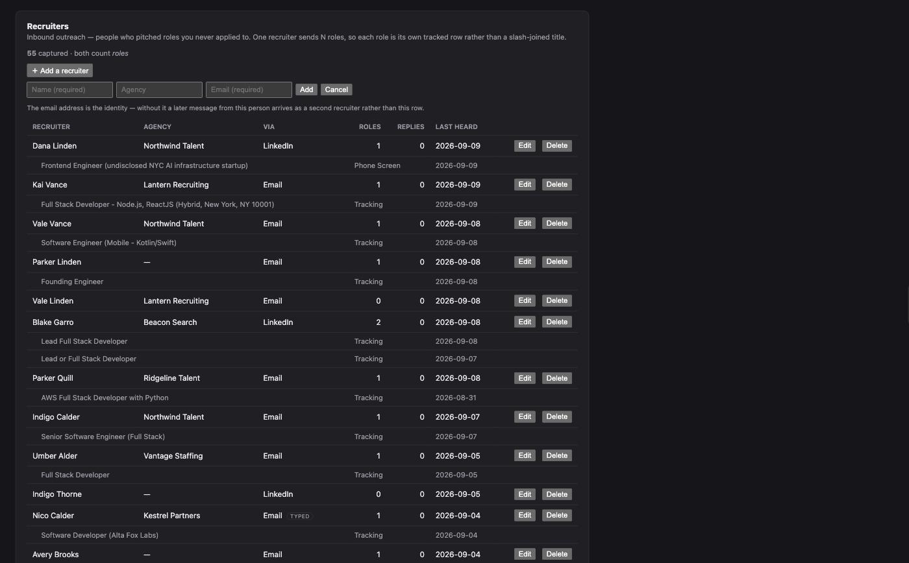

# Job Tracker

A job search that runs itself, mostly.

A local SQLite database holds every application. A Flask GUI shows it three ways.
An MCP server puts it in front of Claude Code, and fourteen skills do the work
around it: read the inbox and reconcile what arrived, score postings against your
resume, draft outreach, file the handful of things that actually need you, and
fill in New York's unemployment paperwork.

It is one person's setup, made forkable. Nothing here phones home; the database
is a file on your disk unless you tell it otherwise.

> Pairs with a private companion repo (`career-ops`) for job discovery and
> interview prep. Nothing here depends on it.

---

## Screens

**Table** — every row, sortable and filterable, with an inline editor per job.



Expanding a row opens the editor: dates, contacts, notes, the recruiter who
sourced it, and the interview rounds logged against it.



**Kanban** — the same rows as a board. Drag a card to change its status.



**Insights** — what is booked, and what the funnel actually did.



Rounds are judged on one question: did anything follow it? Rates stay as plain
counts until the sample can support a percentage.



Recruiters are tracked separately, because inbound outreach is a different path
through the funnel than applying.



---

## Quick start

```bash
python3 -m venv .venv && source .venv/bin/activate
pip install -r requirements.txt

cp .env.example .env                            # leave TURSO_* blank for local SQLite
cp config/profile.example.md config/profile.md  # your name, addresses, document ids

python3 src/jobs_gui.py                         # http://127.0.0.1:5151
```

**There is no bootstrap or migration step.** The first request creates
`data/jobs.db` with the current schema. Every page renders empty, and **+ Add
Job** works immediately — paste a Greenhouse, Lever or Ashby URL, hit **Fetch**,
and it fills in the fields for you.

That is the whole of it if all you want is the tracker. Everything below is for
the automation around it.

---

## Make it yours

Two files, both gitignored:

| File | Holds | Read by |
|---|---|---|
| `.env` | credential paths, cloud endpoints, secrets | Python, via `src/config.py` |
| `config/profile.md` | your name, email addresses, LinkedIn, resume Doc ID, spreadsheet ID | `src/config.py` **and** the skills |

Identity lives in `config/profile.md` rather than `.env` because skills are
Markdown and cannot read environment variables. Both consumers parse the same
front matter, so there is one place to change your email address rather than
seven. Environment variables still win where both define something, so a
scheduled run can be pointed elsewhere without editing a tracked file.

Each skill opens by reading that profile and **stops** if it is missing, rather
than guessing. A guessed address here sends real mail to a real person.

<details>
<summary>Things the profile does not cover</summary>

- **`GOOGLE_PROJECT_ID` for MCP.** `.mcp.json` expands the *shell* environment,
  not `.env`. Put it under `"env"` in `.claude/settings.local.json` as well.
- **Toolchain paths in `scripts/run-*.sh`** — a pinned pyenv version and a pinned
  Node version. See [Scheduling](#scheduling).
- **`scripts/ws5/evidence.json`** — an append-only record of real applications.
  Reset it to `[]` in a fork.
- **Narrative comments** in `src/jobs_db.py`, `mcp_servers/job_tracker/server.py`
  and the tests still name the original author while explaining why a rule
  exists. They are accounts of real incidents; nothing reads them.

</details>

---

## The database

One file, `data/jobs.db`, created on demand. Five tables:

| Table | Holds |
|---|---|
| `jobs` | the tracker. Primary key is `(company, date_added, position_title, link)` |
| `interviews` | rounds per job — type, scheduled vs occurred, self-rating |
| `recruiters` | inbound outreach; `email` is the identity |
| `recruiter_jobs`, `recruiter_messages` | which roles came through whom, and what was said |
| `meta` | scalars, including the inbox-triage watermark |

**Migrations run themselves.** `_ensure_schema()` fires on the first connection
and brings an old database forward — widening the `jobs` primary key, making
`interviews.occurred_date` nullable via a table rebuild, adding indexes. There is
no separate migrate command and no version file.

### Going cloud (optional)

Set `TURSO_DATABASE_URL` and every entry point — GUI, MCP server, cron scripts, a
throwaway `python3 -c` — writes to Turso instead. There is no staging tier.

```bash
python3 -c "import sys; sys.path.insert(0,'.'); from src import jobs_db; print(jobs_db._use_libsql())"
```

`True` means the next write is production. **Blank is not the same as absent:**
`load_dotenv(override=False)` refills a variable that is *unset*, so forcing local
for one command means passing it empty —

```bash
TURSO_DATABASE_URL="" TURSO_AUTH_TOKEN="" python3 ...
```

— which is what `tests/conftest.py` does for the whole suite, after a run without
it wrote 138 job rows into the live database. Snapshot before a schema change; a
file copy of `data/jobs.db` snapshots nothing once you are on Turso:

```bash
turso db shell job-tracker ".dump" > data/turso-snapshot-$(date +%Y%m%d-%H%M%S).sql
```

`JOBS_DB` points the local path somewhere else without moving `data/jobs.db`
aside.

---

## The GUI

```bash
python3 src/jobs_gui.py    # http://127.0.0.1:5151
```

Port 5151, hardcoded. Three pages — `/` (table), `/kanban`, `/insights` — over a
JSON API you can build on:

| Endpoint | Does |
|---|---|
| `GET /api/jobs` | the list. `?limit=` + `?cursor=` paginate; `?include_archived=1` |
| `GET /api/jobs/detail` | per-row extras on expand — summary and interview rounds |
| `GET /api/jobs/export.csv` | CSV of everything not archived |
| `POST /api/jobs/fetch_url` | scrape a posting. Greenhouse/Lever/Ashby APIs, else HTML. Refuses LinkedIn, Indeed and Glassdoor |
| `POST /api/jobs/add` \| `/update` \| `/delete` | 409 on a duplicate link; updates are gated by `EDITABLE_COLUMNS` |
| `POST /api/jobs/recruiter` | link or unlink a recruiter; 409 if triage set it, unless `override` |
| `GET /api/funnel` \| `/silence` \| `/recruiters` \| `/interviews/*` | what `/insights` renders |

Setting a job to **Applied** stamps `date_applied` for you.

---

## MCP servers

Six, in `.mcp.json`. Only the first belongs to this repo.

| Server | What it is | Needs |
|---|---|---|
| `job_tracker` | this repo's server over the database | the `mcp` package on the interpreter |
| `gmail_personal` | your main inbox | OAuth on first run |
| `gmail_alt` | a second account — **read-only by design** | a second OAuth token |
| `gtasks`, `gtasks_alt` | Google Tasks, where triage files what needs you | `GTASKS_*` |
| `gsheets` | the legacy Sheets path | `GOOGLE_PROJECT_ID`, service account |

**`.mcp.json` launches `job_tracker` by relative path, so the working directory
must be the repo root.** It exposes 23 tools:

- **Jobs** — `list_all_jobs`, `filter_jobs`, `get_job_by_company`, `add_job`,
  `update_job_status`, `update_notes`, `update_summary`, `update_contacts`,
  `find_job_for_email`, `archive_old_jobs`, `list_jobs_added_recently`
- **Follow-up** — `list_jobs_needing_followup`, `list_jobs_missing_outreach`,
  `mark_outreached`
- **Interviews** — `list_interviews`, `interview_rates`
- **Recruiters** — `list_recruiters`, `recruiter_roles`,
  `record_recruiter_outreach`, `record_recruiter_reply`
- **Stats** — `get_stats`

---

## Skills

Invoke any of them in Claude Code as `/skill-name [args]`.

### Portable — these work anywhere

| Skill | Does | Needs |
|---|---|---|
| `job-tracker` | fetch a posting URL, extract it, log it, optionally tailor a resume copy | `job_tracker`, Drive |
| `job-digest` | print every tracked job as applied / stale / not-applied | `job_tracker` |
| `source-jobs` | X-ray Ashby, Greenhouse, Lever and Notion; score hits against your resume | web search, Drive |
| `resume-review` | recruiter-style resume-vs-JD scoring, bullet rewrites, ATS scan | Docs, Drive |
| `outreach-email` | draft a referral email or a LinkedIn note | `gmail_personal` |
| `stacked-pr` | ship a multi-phase feature as a stack of PRs | git, `gh` |

### Mail automation — wants both inboxes plus Google Tasks

| Skill | Does | Schedule |
|---|---|---|
| `inbox-triage` | reconcile new mail against the tracker; create tasks **only** for what needs a human. Never sends | 3×/day |
| `application-digest` | 24 hours of application updates, emailed to you | daily 08:00 |
| `follow-up-reminder` | nudge on applications stalled 7+ days; draft follow-ups | daily 09:00 |
| `sent-followup` | scan sent mail for silence; draft follow-ups, max 2 per thread | on demand |
| `archive-jobs` | soft-archive rows older than 60 days, then summarize | monthly, 1st |

`inbox-triage` is the largest and the most opinionated: silence is the default.
Roughly 90% of inbound mail is auto-acknowledgment or rejection, which updates the
tracker and is never surfaced as a task. Its mechanical predicates live in
`src/triage_rules.py` where they can be tested; only genuine judgement stays in
the skill.

### Probably not for you

| Skill | Why |
|---|---|
| `work-search-record` | fills New York State's WS-5 unemployment form. Useless elsewhere |
| `applypass-inbound` | imports one specific paid auto-apply service's export format |
| `new-session` | opens a Terminal window. macOS only |

---

## Scheduling

Seven launchd agents drive the scheduled skills. The real plists live outside the
repo, so templates ship in [`scripts/launchd/`](scripts/launchd/) — that
directory's README covers loading them and, more importantly, the two pinned
toolchain paths in every `scripts/run-*.sh` that will be wrong on your machine.

The short version: launchd starts with a minimal `PATH`, so each script rebuilds
one. The pinned Python must be the interpreter that has `mcp` installed, or the
`job_tracker` server dies on import and the run proceeds with no tracker tools and
no obvious explanation. The model is pinned deliberately too — an interactive
`/model` change once silently repointed every scheduled job.

### Cloud runs

`scripts/cloud-bootstrap.sh` reconstructs credential files from secrets at run
time, for environments that get a bare clone:

```bash
scripts/cloud-bootstrap.sh scripts/run-inbox-triage.sh
```

It wants `GMAIL_OAUTH_KEYS`, `GMAIL_REFRESH_TOKEN`, `GMAIL_ALT_REFRESH_TOKEN` and
`GCP_SERVICE_ACCOUNT`, and exits 78 naming whichever is missing — never its value.

---

## Safety rails

`.claude/settings.json` carries a deny list, and it is the thing standing between
unattended automation and sent mail. Denied outright: every Gmail delete and trash
tool, the whole `gmail_alt` write surface, `gtasks` delete and clear, and
**`mcp__gmail_personal__send_email`**.

That last one is worth understanding before you fork. Four skills call it —
`application-digest`, `archive-jobs`, `follow-up-reminder`, `work-search-record` —
and their run scripts pass it in `--allowedTools`. Deny beats an allowlist, so
those sends only go through where this settings file is not in effect. Decide
deliberately which side of that you want to be on.

`inbox-triage` never sends mail at all, by design.

---

## Screenshots

The images above come from a scrubbed copy of a real tracker:

```bash
python3 scripts/make_demo_db.py                        # -> data/demo.db
TURSO_DATABASE_URL="" TURSO_AUTH_TOKEN="" JOBS_DB=data/demo.db \
    python3 src/jobs_gui.py
```

Companies, titles, statuses, dates and interviews are real — the funnel's shape is
the point, and it has to be true. Recruiter names, addresses, contacts, notes and
message subjects are generated. The seed is fixed, so a re-run reproduces the same
images rather than quietly changing them under a committed file.

---

## Browser extension

`browser_extension/applypass_capture/` is a Chrome DevTools panel that merges
paginated ApplyPass export responses into one JSON file for `applypass-inbound`.
It requests no permissions and never touches the database.

`chrome://extensions` → Developer mode → **Load unpacked** → pick that directory.
Tests: `node --test browser_extension/applypass_capture/`.

---

## Tests

```bash
pytest -q        # 374 tests
```

`tests/conftest.py` strips `TURSO_*` before any test module is imported, and again
before every single test, because anything importing dotenv mid-run can put it
back. That guard exists because a run without it wrote 138 job rows, 78 interviews
and 4 recruiters into the live database before it was killed. The consequence is
that no test exercises the libSQL path.

The suite also pins `tests/fixtures/profile.test.md`, so it asserts against fixed
values rather than whatever profile happens to be on the machine running it.

Worth knowing:

- `tests/test_jobs_gui.py` — the best single smoke test. Builds a temp database,
  seeds it, and drives the Flask app end to end.
- `tests/test_migrations.py` — the only place the upgrade path is checked. Run it
  before any schema change.
- `tests/test_job_fields_js.py` — shells out to `node` against the real
  `src/static/job_fields.js`. Skips cleanly without node.

---

## Layout

```
src/
  jobs_gui.py       Flask app — three pages and the JSON API
  jobs_db.py        the data layer; schema, migrations, every query
  job_agent.py      posting scraper; Greenhouse/Lever/Ashby APIs, else HTML
  triage_rules.py   the mechanical half of inbox-triage, tested
  config.py         every per-install value resolves here
mcp_servers/
  job_tracker/      the MCP server — 23 tools over jobs_db
.claude/skills/     fourteen skills
scripts/
  run-*.sh          scheduled entry points
  launchd/          plist templates
  ws5/              New York WS-5 form builder
  make_demo_db.py   scrubbed copy for screenshots
config/profile.md   your identity (gitignored)
data/jobs.db        the tracker (gitignored)
```
